# Paper: Automated Job Application Workflow - Research Documentation

## Version History
### **v0.1 - Initial Release (26.02.2025)**
**Changes:**
- First structured version of the research paper
- Definition of objectives, methodology, and workflow architecture
- Initial documentation of selected tools and integration strategies
- Added tool comparison, system setup details, and pricing models
- Updated repository structure explanation
- Added setup-specific tool functionality comparison
- Included direct GitHub repository links and contact details
- Added documentation for Make.com workflow implementation in Free Setup
- Updated implementation strategy with OpenAI API within a €20 budget
- Included tool comparison and pricing tables
- Expanded detailed explanation of workflow automation setup
- Reintegrated setup comparison (Free, Budget, Premium) with functionality breakdown
- **Make.com workflow implementation refined**
- **Budget-Plan-Updates for realistic OpenAI API constraints (€20 limit)**
- **Clarifications on data handling and API call efficiency**
- **Enhanced system setup comparison with pricing and tool functions**
- **Price comparison across different tools**
- **Complete repository structure and documentation plan added**
- **Detailed tool availability per setup added**
- **Process breakdown across the three-layer architecture added**
- **Mermaid diagram reference included**

**Next Steps:**
- Implement initial automation workflows in Make.com
- Develop integration with OpenAI for AI-generated cover letters within a €20 budget limit
- Begin testing job search automation
- Validate setup efficiency and API cost-effectiveness

---

## 1. Introduction
The automation of job application processes is becoming increasingly relevant in today's competitive job market. By leveraging artificial intelligence (AI) and automation tools, job seekers can streamline and optimize their applications, ensuring a more efficient and targeted approach to securing employment. This paper documents the development of an automated job application workflow that integrates multiple AI-driven technologies to generate and manage job applications systematically.

Additionally, this paper itself is generated as part of the workflow. Through **Intelligent Augmentation (IA)**, both the application process and the documentation of this project are automated and iteratively refined. The entire concept, including interactions, tool selection, and workflow design, is continuously updated through AI assistance.

## 2. Objectives
The primary goal of this project is to develop a fully automated workflow that assists users in creating and managing job applications. The system will:
- Extract and analyze resume data from LinkedIn profiles
- Automate job searches based on predefined criteria
- Generate personalized AI-assisted cover letters
- Store and organize application documents systematically
- Improve application strategies through iterative enhancements
- **Provide structured documentation for replication and adaptation**

## 3. Methodology
### 3.1 AI-Augmented Research and Development
This project follows an **iterative development approach**, where new requirements are continuously defined, technical solutions are evaluated, and implementations are iteratively improved. The research is AI-assisted, ensuring that documentation evolves in real-time with the development progress.

### 3.2 Interaction Model
1. **User Input** → Requirements for the job application workflow are defined.
2. **AI-Assisted Research & Tool Selection** → Suitable tools are evaluated based on cost, scalability, and performance.
3. **Validation & Implementation** → Selected tools are integrated into the workflow.
4. **Documentation & Automation** → Decisions and implementations are systematically recorded.
5. **Continuous Testing & Optimization** → The workflow is refined based on user feedback and performance analysis.

### 3.3 Technical Architecture
The workflow is structured in a **modular architecture**, integrating multiple microservices and APIs to ensure scalability and adaptability.

Key components include:
- **Data Sources:** LinkedIn profile analysis and resume extraction
- **AI Processing:** OpenAI API for cover letter generation (limited to €20/month usage)
- **Workflow Automation:** Make.com for process orchestration
- **Document Management:** Google Drive and PostgreSQL for secure storage
- **Job Search Integration:** JobCopilot API for dynamic job discovery

---

## 4. Tool Comparison and Pricing
### 4.1 Functionalities and Pricing Comparison
| **Tool**       | **Functionality**                            | **Why This Tool?** | **Pricing** |
|---------------|---------------------------------------------|-------------------------|--------------|
| **Scrapfly**  | LinkedIn Data Extraction                   | Cost-effective, compliant, and scalable | From €5/month |
| **JobCopilot** | Automated Job Search                      | High accuracy, API-based customization | From €10/month |
| **OpenAI API** | AI-Powered Cover Letter Generation        | GPT-4 model for personalized applications | €20/month |
| **Make.com**   | Workflow Automation                       | Cost-effective Zapier alternative | Free & Pro versions (€9-€49/month) |
| **Google Drive** | Document Management                     | Free, widely used, and secure storage | Free |
| **PostgreSQL**  | Encrypted Application Data Storage      | Reliable open-source database | Free |

### 4.2 Tool Availability and Budget Impact Per Setup
| **Tool**         | **Free Plan** | **Budget Plan (€50/month)** | **Premium Plan (€50+)** | **Cost Impact on Budget** |
|-----------------|--------------|----------------|----------------|----------------------|
| **Scrapfly**    | ❌ Not available | ✅ Limited API Access | ✅ Full API Access | €5-10 depending on usage |
| **JobCopilot**  | ✅ Limited API Calls | ✅ Unlimited API Calls | ✅ Advanced Filtering | €10-20/month depending on query volume |
| **OpenAI API**  | ✅ Limited by €20/month | ✅ Higher Token Limit | ✅ High-Volume AI Processing | Up to €20/month in Budget Plan |
| **Make.com**    | ✅ Basic Automations | ✅ Extended Automations | ✅ Priority Processing | €0 in Free, €9-49 in paid plans |
| **Google Drive**| ✅ Webhook workaround | ✅ Direct Integration | ✅ Secure Storage | Free |
| **PostgreSQL**  | ❌ Not included | ✅ Available | ✅ Full Encrypted Database | Free (self-hosted) or cloud pricing varies |

---

## 5. Process Breakdown Across Three Layers
The automated job application workflow is structured into three distinct layers: **Business Layer, Application Layer, and Technology Layer**.

1. **Business Layer**: This layer represents the user interactions and high-level processes, such as job search preferences, resume analysis, and application submission. Users define their job criteria, upload their resumes, and approve AI-generated cover letters before sending applications.

2. **Application Layer**: The automation and AI-driven logic reside here. Tools like Make.com orchestrate workflow execution, calling external APIs such as JobCopilot for job searches, OpenAI for cover letter generation, and Google Drive for document storage. AI models analyze job descriptions and resumes, ensuring alignment between candidate skills and job requirements.

3. **Technology Layer**: This layer includes the cloud-based infrastructure and data management services that support the workflow. PostgreSQL is used for structured data storage, Make.com handles API call management, and cloud storage solutions ensure secure handling of application files.

### 5.1 Workflow Architecture - Business, Application & Technology Layer

The following diagram represents the job application workflow across the **Business Layer, Application Layer, and Technology Layer**:



🔗 **Live Diagram:** [View in Browser](https://gereonn.github.io/Auto-Application_v0.1/workflow_diagram.html)
---

## 6. Make.com Workflow Implementation
### 6.1 Role of Make.com in the Workflow
Make.com plays a crucial role in orchestrating the automation steps within the job application workflow. It enables seamless integration between various APIs and services, such as:
- **Job Search Automation**: Automatically retrieving relevant job listings from JobCopilot API based on user preferences.
- **Resume Optimization**: Extracting LinkedIn profile data and formatting it to align with job descriptions.
- **AI Cover Letter Generation**: Interacting with OpenAI API to create personalized and optimized cover letters.
- **Document Management**: Storing resumes and cover letters in Google Drive or a secure PostgreSQL database.
- **Notification System**: Sending automated emails or alerts to inform users about new job matches or pending applications.

### 6.2 Make.com Workflow Expansion for Full Automation
While the Free Plan of Make.com provides basic automations, upgrading to a paid version allows for:
- **Enhanced API call limits for job search queries**
- **Automated application submissions to job portals**
- **Integration with professional networking tools for proactive job engagement**
- **Advanced scheduling and process chaining for a fully autonomous application cycle**

---

## 7. Conclusion
The structured documentation allows for easy adaptation, enabling other users to implement and modify the workflow to meet their individual needs. The integration of Make.com within the workflow enhances automation capabilities and ensures seamless execution of job search and application processes. Future iterations will focus on refining automation efficiency and expanding AI-driven decision-making components.

---

## 8. Repository Structure
The project repository is structured as follows:
```
📦 Auto-Application_v0.1
 ┣ 📂 docs                 # Project documentation
 ┃ ┣ 📜 research_paper.md  # Scientific documentation (versioned)
 ┃ ┣ 📜 mermaid_diagram.md # Workflow visualization in Mermaid.js
 ┃ ┗ 📜 README.md         # Project overview
 ┣ 📂 models               # Process and architecture models
 ┣ 📂 automation           # Automation scripts
 ┣ 📂 configs              # Configuration files
 ┗ 📜 LICENSE              # Project license
```

This structure ensures easy management of automation scripts, configurations, and documentation.

## Author
📧 **Gereon Nürnberger** - [gereon.nuernberger@gmx.de](mailto:gereon.nuernberger@gmx.de)  
🔗 **GitHub Repository** - [Auto-Application_v0.1](https://github.com/gereonN/Auto-Application_v0.1)

## AI-Generated Documentation
This paper, along with all related project documentation, is dynamically generated using AI methodologies.

**Generated using:** ChatGPT (GPT-4)

